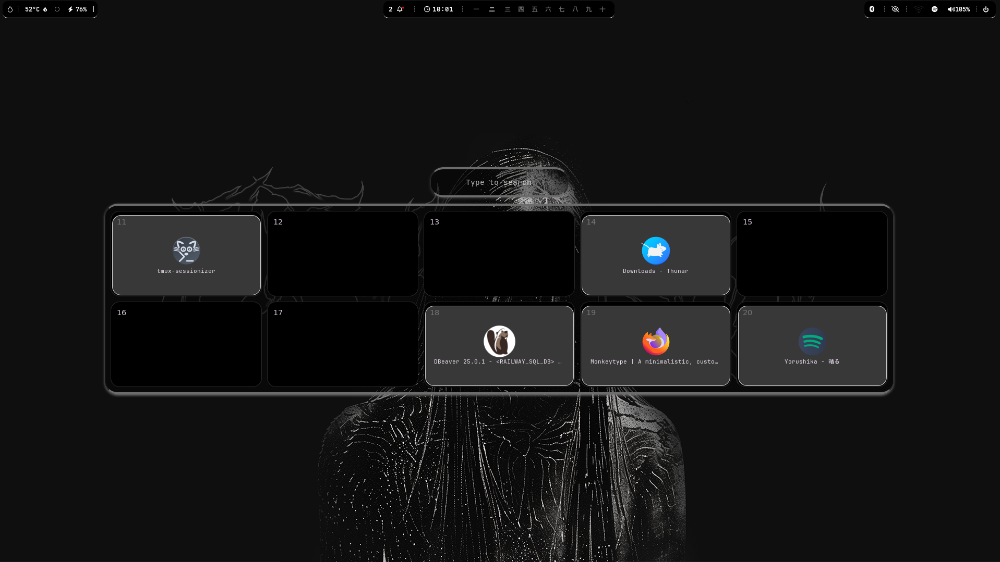

##### for ags to work, download v1.8.2 
https://github.com/Aylur/ags/releases
##### then buiild it  
npm install 
meson setup build 
meson install -C build 
##### finally, put it in ignoreList for your specific pkg manager to avoid updates
e.g for arch /etc/pacman.conf and put it in ignoreList

##### Works with multiple monitors as long you have hyprland split workspaces plugin. here is a pic for second monitor workspace 11-20

